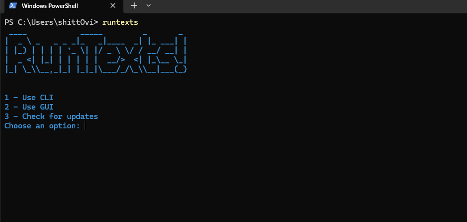

### `runtexts` is a command-line and graphical user interface (GUI) tool designed to automate the sending of messages.



## Features

- Automate the sending of messages.
- Set a custom delay between messages.
- Simulate fast "bot-like" typing or slower "human-like" typing.
- Simple CLI interface for easy use.
- Option to use a GUI for a more visual experience.
- "Infinity" mode for endless message sending.

## Installation

You can install `runtexts` using pip:

```bash
pip install runtexts
```

### Or manually,

**✔ Use this method if having problem of installing latest version from PyPi !!!**

1. Clone this repo:

```bash
git clone https://github.com/iamovi/project_runtexts.git
```

2. Go to project directory:

```bash
cd project_runtexts
````

3. Install cli using:

```bash
pip install .
```

## Usage

Once installed, you can run the tool directly from the command line:

```bash
runtexts
```

- Simply run `runtexts` to use the program.

**Or Single use:**

```bash
runtexts cli
```

- this will show runtexts cli prompts.

- Follow the on-screen prompts to configure your message, number of repetitions, typing speed, and delay.

```bash
runtexts gui
```

- this will open a graphical user-interface.

### Upgrade CLI if available:

```bash
pip install --upgrade runtexts
```

## Example

Here is a typical usage scenario:

1. Enter the message you'd like to send.
2. Choose how many times to send the message or set it to "infinity" for endless messaging.
3. Set the delay between each message (in seconds).
4. Choose between fast (bot) or slow (human) typing modes.
5. The tool will automatically type and send the messages.

***And use runtexts GUI for easy process.***

**Type runtexts --help for details.**

## License

This project is licensed under the [MIT License](LICENSE) - see the [LICENSE](LICENSE) file for details.

## Author

Maruf Ovi

fornet.ovi@gmail.com